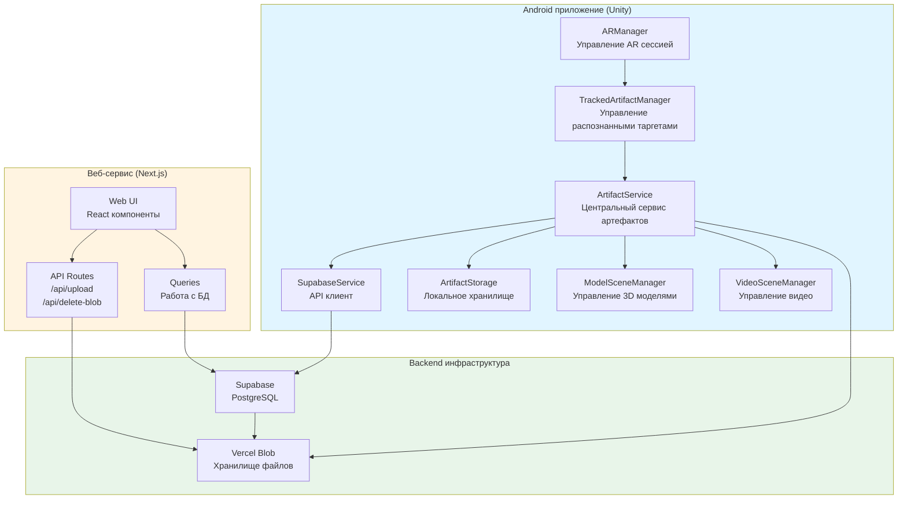

# Общая архитектура системы AR-tifact

## Описание системы

AR-tifact - это комплексная система для управления и отображения AR контента, состоящая из трех основных компонентов:

1. **Android приложение** (Unity) - мобильное приложение для распознавания таргетов через AR и отображения 3D моделей или видео
2. **Веб-сервис** (Next.js) - система управления контентом (CMS) для загрузки и редактирования артефактов, медиа файлов и таргетов
3. **Backend инфраструктура** - база данных (Supabase/PostgreSQL) и хранилище файлов (Vercel Blob)

## Технологический стек

### Android приложение
- **Unity** - игровой движок для разработки AR приложения
- **ARFoundation** - фреймворк для работы с AR на Android
- **C#** - язык программирования
- **UnityGLTF** - библиотека для загрузки GLB/GLTF 3D моделей

### Веб-сервис
- **Next.js** - React фреймворк для веб-приложений
- **TypeScript** - типизированный JavaScript
- **React** - библиотека для построения UI
- **Tailwind CSS** - CSS фреймворк
- **Radix UI** - компоненты UI

### Backend
- **Supabase** - Backend-as-a-Service (PostgreSQL + REST API)
- **Vercel Blob** - хранилище файлов
- **PostgreSQL** - реляционная база данных

## Архитектурная диаграмма

## Компоненты и их взаимодействие

### Android приложение

**ARManager** - управляет AR сессией, инициализирует ARFoundation, проверяет доступность AR на устройстве.

**TrackedArtifactManager** - отслеживает распознанные таргеты через ARTrackedImageManager, запрашивает артефакты для распознанных таргетов.

**ArtifactService** - центральный сервис для работы с артефактами:
- Запрос артефактов из Supabase
- Кеширование артефактов локально
- Управление историей сканирования
- Координация загрузки медиа

**ModelSceneManager** - управляет размещением 3D моделей на AR сцене, координирует работу с ModelLoaderService.

**VideoSceneManager** - управляет размещением видео на AR сцене, поддерживает YouTube и локальные видео файлы.

**ArtifactStorage** - локальное хранилище для кеширования артефактов, медиа файлов и истории сканирования.

**SupabaseService** - клиент для работы с Supabase REST API.

### Веб-сервис

**Web UI** - React компоненты для управления контентом:
- Создание/редактирование артефактов
- Загрузка медиа файлов (3D модели, видео, YouTube)
- Загрузка таргетов (маркеров)
- Аутентификация пользователей

**API Routes** - серверные маршруты:
- `/api/upload` - загрузка файлов в Vercel Blob
- `/api/delete-blob` - удаление файлов из Vercel Blob

**Queries** - функции для работы с базой данных Supabase.

### Backend инфраструктура

**Supabase (PostgreSQL)** - база данных для хранения:
- Артефакты (artifacts)
- Медиа ресурсы (media)
- Таргеты (targets)
- Связи артефактов с медиа (artifact_media)

**Vercel Blob** - хранилище файлов:
- 3D модели (GLB файлы)
- Видео файлы (MP4, WebM)
- Изображения таргетов
- Превью изображения артефактов

## Поток данных

1. **Распознавание таргета (Android)**:
   - ARManager инициализирует AR сессию
   - TrackedArtifactManager распознает таргет через камеру
   - ArtifactService запрашивает артефакт из Supabase по targetId
   - Загружается медиа (3D модель или видео) из Vercel Blob
   - Медиа кешируется локально через ArtifactStorage
   - ModelSceneManager или VideoSceneManager размещает медиа на AR сцене

2. **Создание артефакта (Web)**:
   - Пользователь создает артефакт через веб-интерфейс
   - Медиа файлы загружаются в Vercel Blob через API
   - Метаданные сохраняются в Supabase
   - Таргеты загружаются и анализируются на качество
   - Артефакт становится доступным для Android приложения

## Безопасность

- **Row Level Security (RLS)** в Supabase - публичный доступ только для чтения активных артефактов
- **Аутентификация** - только авторизованные пользователи могут создавать/редактировать контент
- **Валидация таргетов** - минимальный балл качества 75 для таргетов

