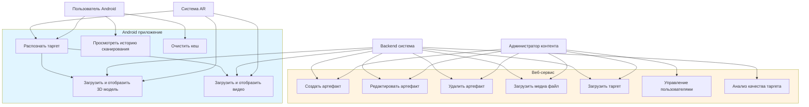

# Use Case диаграммы

## Описание

Use case диаграммы описывают функциональные требования системы с точки зрения пользователей и системы.

## Акторы

- **Пользователь Android** - пользователь мобильного приложения
- **Администратор контента** - пользователь веб-интерфейса для управления контентом
- **Система AR** - AR подсистема Android приложения
- **Backend система** - Supabase и Vercel Blob

## Use Case диаграмма

## Детальное описание Use Cases

### Android приложение

#### UC1: Распознать таргет
**Актор:** Пользователь Android, Система AR

**Описание:** Пользователь наводит камеру на таргет (маркер), система AR распознает таргет и определяет его ID.

**Основной поток:**
1. Пользователь открывает приложение
2. ARManager инициализирует AR сессию
3. Пользователь наводит камеру на таргет
4. TrackedArtifactManager распознает таргет через ARTrackedImageManager
5. Система определяет targetId из библиотеки таргетов
6. ArtifactService запрашивает артефакт для targetId

**Альтернативные потоки:**
- AR не поддерживается на устройстве - показывается сообщение об ошибке
- Таргет не распознан - система продолжает поиск

#### UC2: Загрузить и отобразить 3D модель
**Актор:** Система AR, Backend система

**Описание:** После распознавания таргета система загружает связанную 3D модель и отображает её на AR сцене.

**Основной поток:**
1. ArtifactService получает артефакт из Supabase
2. Система проверяет наличие 3D модели в локальном кеше
3. Если модель отсутствует, загружает из Vercel Blob
4. ModelLoaderService загружает GLB файл
5. ModelSceneManager размещает модель в TrackedModelHost
6. Модель отображается на AR сцене

**Альтернативные потоки:**
- Модель уже в кеше - используется кешированная версия
- Ошибка загрузки - показывается сообщение об ошибке

#### UC3: Загрузить и отобразить видео
**Актор:** Система AR, Backend система

**Описание:** После распознавания таргета система загружает связанное видео и отображает его на AR сцене.

**Основной поток:**
1. ArtifactService получает артефакт из Supabase
2. Система определяет тип видео (локальное или YouTube)
3. Для локального видео проверяется кеш, при отсутствии загружается из Vercel Blob
4. VideoSceneManager размещает видео в TrackedVideoHost
5. Видео воспроизводится на AR сцене

**Альтернативные потоки:**
- YouTube видео - воспроизводится напрямую по URL
- Видео в кеше - используется кешированная версия
- Ошибка загрузки - система пытается автовосстановить файл

#### UC4: Просмотреть историю сканирования
**Актор:** Пользователь Android

**Описание:** Пользователь просматривает историю ранее отсканированных таргетов.

**Основной поток:**
1. Пользователь открывает экран истории
2. ArtifactService загружает историю из локального хранилища
3. Отображается список отсканированных артефактов с превью
4. Пользователь может выбрать артефакт для просмотра деталей

#### UC5: Очистить кеш
**Актор:** Пользователь Android

**Описание:** Пользователь очищает локальный кеш артефактов и медиа файлов.

**Основной поток:**
1. Пользователь выбирает опцию очистки кеша
2. ArtifactStorage удаляет все локальные файлы
3. История сканирования очищается
4. Подтверждение об успешной очистке

### Веб-сервис

#### UC6: Создать артефакт
**Актор:** Администратор контента, Backend система

**Описание:** Администратор создает новый артефакт с названием, описанием, медиа и таргетами.

**Основной поток:**
1. Администратор открывает форму создания артефакта
2. Вводит название и описание
3. Загружает превью изображение
4. Добавляет медиа файлы (3D модели, видео, YouTube ссылки)
5. Загружает таргеты (маркеры)
6. Система анализирует качество таргетов
7. При успешной валидации артефакт сохраняется в Supabase
8. Медиа файлы загружаются в Vercel Blob

**Альтернативные потоки:**
- Таргет не прошел валидацию (балл < 75) - показывается ошибка
- Ошибка загрузки файла - показывается сообщение об ошибке

#### UC7: Редактировать артефакт
**Актор:** Администратор контента, Backend система

**Описание:** Администратор редактирует существующий артефакт.

**Основной поток:**
1. Администратор открывает артефакт для редактирования
2. Изменяет название, описание, медиа или таргеты
3. Система проверяет валидность изменений
4. Обновленные данные сохраняются в Supabase
5. Новые файлы загружаются в Vercel Blob
6. Удаленные файлы удаляются из Vercel Blob

#### UC8: Удалить артефакт
**Актор:** Администратор контента, Backend система

**Описание:** Администратор удаляет артефакт и все связанные данные.

**Основной поток:**
1. Администратор выбирает артефакт для удаления
2. Подтверждает удаление
3. Система удаляет артефакт из Supabase
4. Все связанные файлы удаляются из Vercel Blob
5. Связанные таргеты удаляются

#### UC9: Загрузить медиа файл
**Актор:** Администратор контента, Backend система

**Описание:** Администратор загружает медиа файл (3D модель или видео) для артефакта.

**Основной поток:**
1. Администратор выбирает файл для загрузки
2. Для видео извлекаются метаданные (разрешение, длительность)
3. Файл загружается в Vercel Blob через API
4. Метаданные сохраняются в Supabase
5. Медиа связывается с артефактом

**Альтернативные потоки:**
- YouTube ссылка - сохраняется только URL без загрузки файла
- Ошибка загрузки - показывается сообщение об ошибке

#### UC10: Загрузить таргет
**Актор:** Администратор контента, Backend система

**Описание:** Администратор загружает таргет (маркер) для артефакта.

**Основной поток:**
1. Администратор выбирает изображение таргета
2. Система анализирует качество изображения
3. Если качество >= 75, таргет загружается в Vercel Blob
4. Таргет сохраняется в Supabase и связывается с артефактом

**Альтернативные потоки:**
- Качество < 75 - показывается ошибка валидации
- Ошибка загрузки - показывается сообщение об ошибке

#### UC11: Управление пользователями
**Актор:** Администратор контента

**Описание:** Администратор управляет пользователями системы (создание, редактирование, удаление).

**Основной поток:**
1. Администратор открывает раздел управления пользователями
2. Просматривает список пользователей
3. Создает, редактирует или удаляет пользователей
4. Изменения сохраняются в Supabase Auth

#### UC12: Анализ качества таргета
**Актор:** Backend система

**Описание:** Система анализирует качество загруженного таргета для обеспечения надежного распознавания.

**Основной поток:**
1. Система получает изображение таргета
2. Анализирует контраст, резкость, детализацию
3. Вычисляет балл качества (0-100)
4. Если балл >= 75, таргет принимается
5. Если балл < 75, таргет отклоняется

