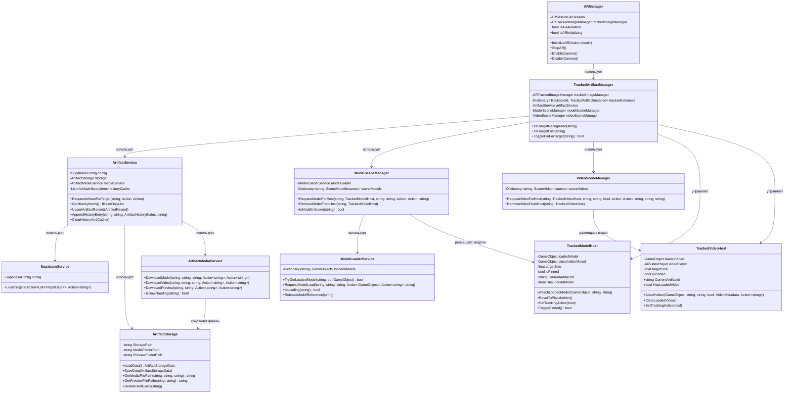
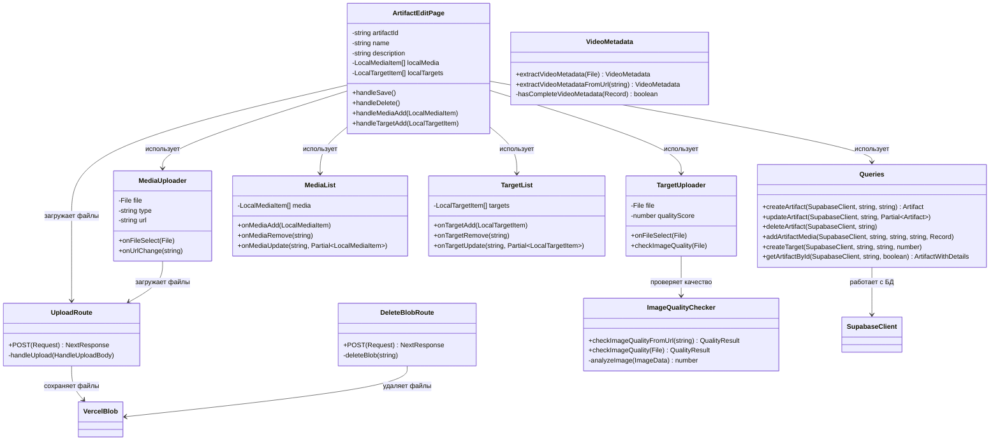

# Диаграмма классов

## Описание

Диаграмма классов показывает структуру основных классов системы, их атрибуты, методы и отношения между ними.

## Диаграмма классов Android приложения

## Диаграмма классов веб-сервиса

## Основные классы и их ответственность

### Android приложение

#### ARManager
**Ответственность:** Управление AR сессией и проверка доступности AR на устройстве.

**Ключевые методы:**
- `InitializeAR()` - инициализирует AR сессию
- `StopAR()` - останавливает AR сессию
- `EnableCamera()` / `DisableCamera()` - управление камерой

#### TrackedArtifactManager
**Ответственность:** Отслеживание распознанных таргетов и координация загрузки артефактов.

**Ключевые методы:**
- Обработка событий `trackablesChanged` от ARTrackedImageManager
- Запрос артефактов через ArtifactService
- Размещение медиа через ModelSceneManager/VideoSceneManager

#### ArtifactService
**Ответственность:** Центральный сервис для работы с артефактами, кеширование и история.

**Ключевые методы:**
- `RequestArtifactForTarget()` - запрашивает артефакт для таргета
- `UpsertArtifactRecord()` - сохраняет/обновляет артефакт в кеше
- `AppendHistoryEntry()` - добавляет запись в историю сканирования
- `GetHistoryItems()` - возвращает историю сканирования

#### ModelSceneManager
**Ответственность:** Управление размещением 3D моделей на AR сцене.

**Ключевые методы:**
- `RequestModelForHost()` - запрашивает модель для размещения в хосте
- `RemoveModelFromHost()` - удаляет модель из хоста
- `IsModelInScene()` - проверяет наличие модели на сцене

#### VideoSceneManager
**Ответственность:** Управление размещением видео на AR сцене.

**Ключевые методы:**
- `RequestVideoForHost()` - запрашивает видео для размещения в хосте
- `RemoveVideoFromHost()` - удаляет видео из хоста
- Поддержка автовосстановления битых видео файлов

#### TrackedModelHost
**Ответственность:** Хост для отображения 3D модели на AR сцене.

**Ключевые методы:**
- `AttachLoadedModel()` - прикрепляет загруженную модель
- `ResetToPlaceholder()` - сбрасывает к плейсхолдеру
- `SetTrackingActive()` - управляет видимостью при потере трекинга
- `TogglePinned()` - закрепляет модель на месте

#### TrackedVideoHost
**Ответственность:** Хост для отображения видео на AR сцене.

**Ключевые методы:**
- `AttachVideo()` - прикрепляет видео
- `ClearLoadedVideo()` - очищает загруженное видео
- `SetTrackingActive()` - управляет воспроизведением при потере трекинга

#### ArtifactStorage
**Ответственность:** Локальное хранилище для кеширования артефактов и медиа.

**Ключевые методы:**
- `LoadData()` - загружает данные из JSON файла
- `SaveData()` - сохраняет данные в JSON файл
- `GetMediaFilePath()` - возвращает путь для сохранения медиа
- `GetPreviewFilePath()` - возвращает путь для сохранения превью

### Веб-сервис

#### ArtifactEditPage
**Ответственность:** Главная страница для создания/редактирования артефактов.

**Ключевые методы:**
- `handleSave()` - сохраняет артефакт в БД
- `handleDelete()` - удаляет артефакт
- `handleMediaAdd()` / `handleMediaRemove()` - управление медиа
- `handleTargetAdd()` / `handleTargetRemove()` - управление таргетами

#### Queries
**Ответственность:** Функции для работы с базой данных Supabase.

**Ключевые методы:**
- `createArtifact()` - создает артефакт
- `updateArtifact()` - обновляет артефакт
- `addArtifactMedia()` - добавляет медиа к артефакту
- `createTarget()` - создает таргет

#### ImageQualityChecker
**Ответственность:** Анализ качества изображений таргетов.

**Ключевые методы:**
- `checkImageQualityFromUrl()` - проверяет качество по URL
- `checkImageQuality()` - проверяет качество файла
- Возвращает балл качества (0-100)

#### VideoMetadata
**Ответственность:** Извлечение метаданных из видео файлов.

**Ключевые методы:**
- `extractVideoMetadata()` - извлекает метаданные из файла
- `extractVideoMetadataFromUrl()` - извлекает метаданные по URL
- Возвращает разрешение, длительность, размер файла

## Отношения между классами

### Композиция
- `TrackedArtifactManager` содержит `TrackedModelHost` и `TrackedVideoHost`
- `ArtifactService` использует `ArtifactStorage` для хранения данных

### Зависимости
- `TrackedArtifactManager` зависит от `ArtifactService`, `ModelSceneManager`, `VideoSceneManager`
- `ModelSceneManager` зависит от `ModelLoaderService`
- `ArtifactEditPage` зависит от `Queries` для работы с БД

### Ассоциации
- `ArtifactService` ассоциирован с `SupabaseService` для API запросов
- `ArtifactMediaService` ассоциирован с `ArtifactStorage` для сохранения файлов

