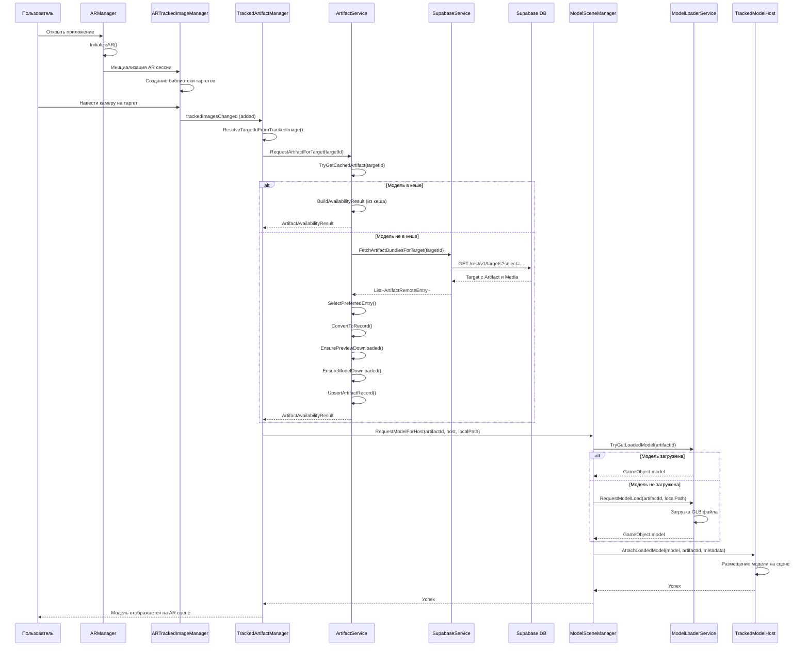
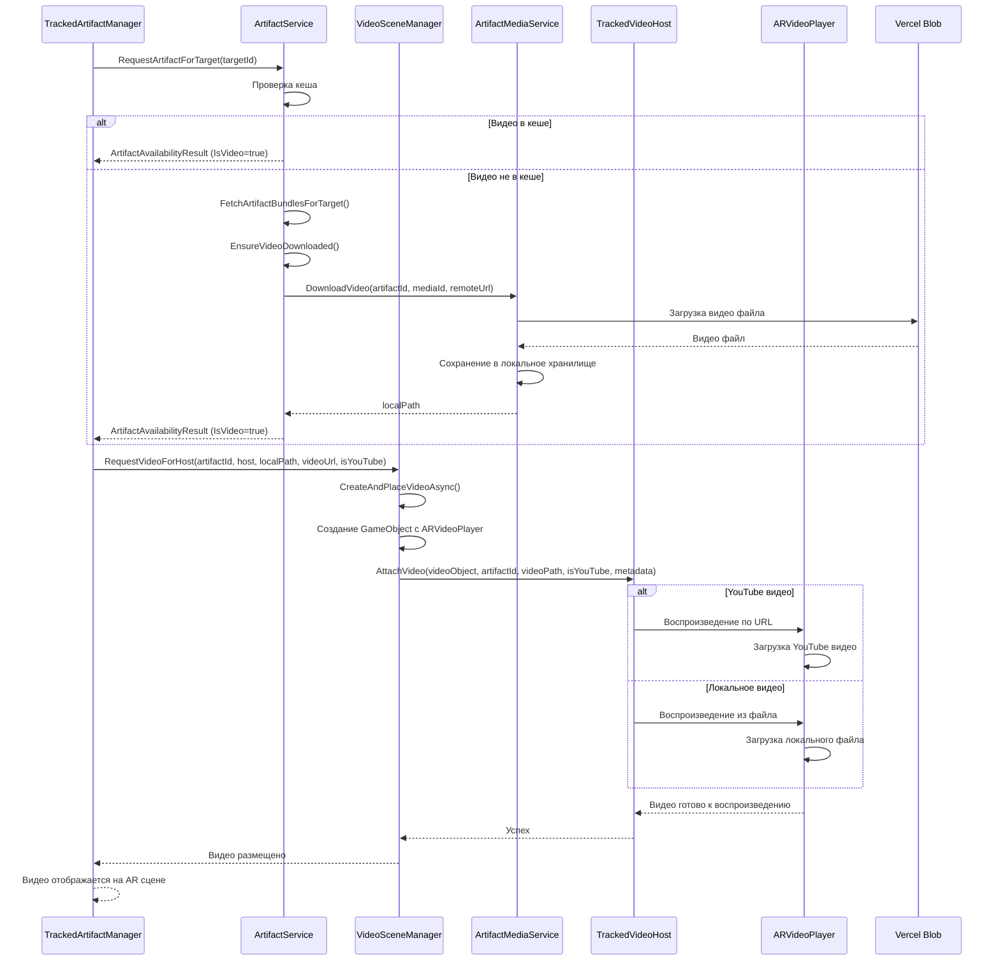
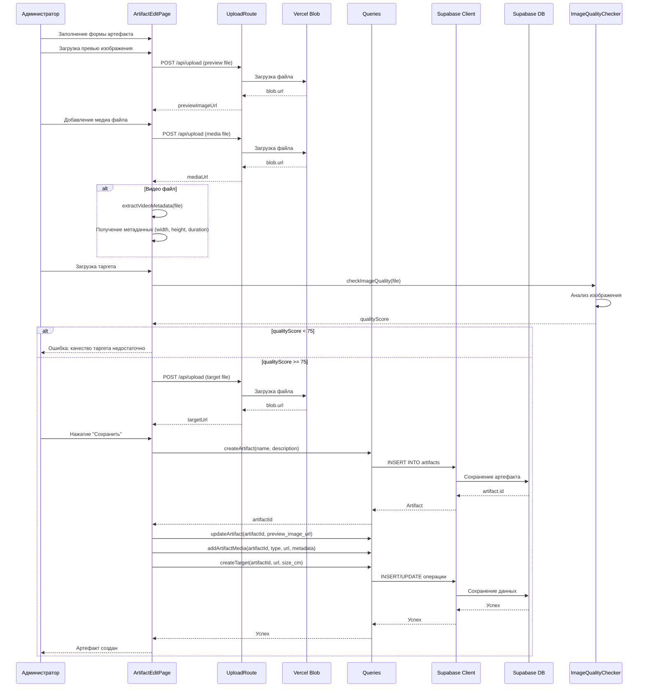
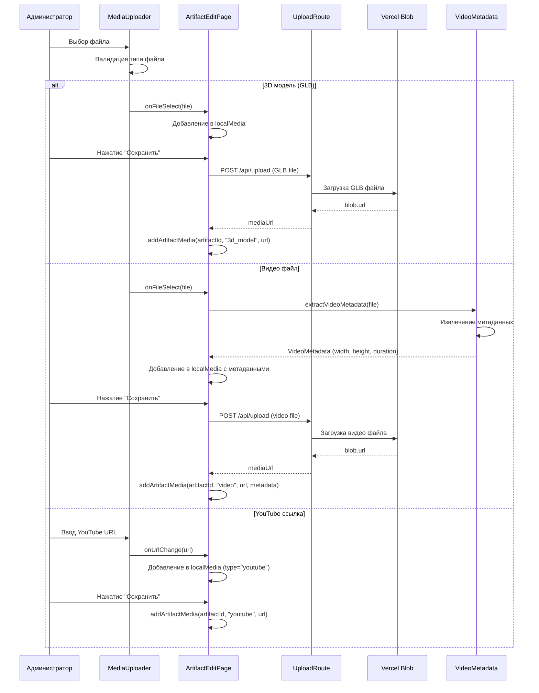
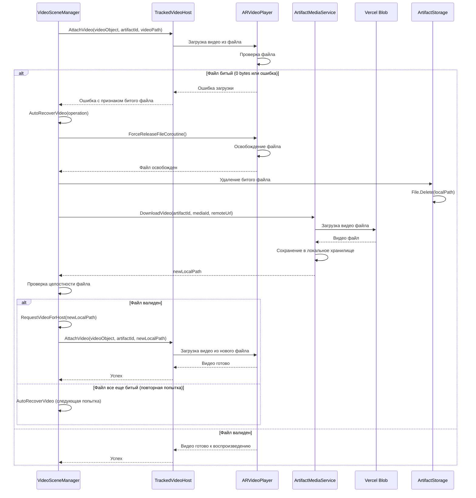
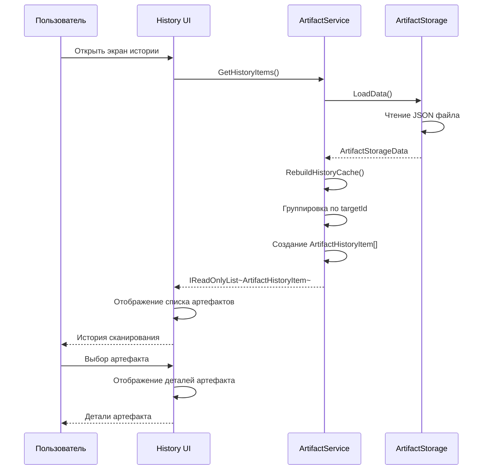

# Sequence диаграммы

## Описание

Sequence диаграммы показывают последовательность взаимодействий между компонентами системы во времени для ключевых процессов.

## 1. Распознавание таргета и загрузка артефакта (Android)

## 2. Загрузка и отображение видео

## 3. Создание артефакта через веб-интерфейс

## 4. Загрузка медиа файла

## 5. Автовосстановление битого видео файла

## 6. Просмотр истории сканирования

