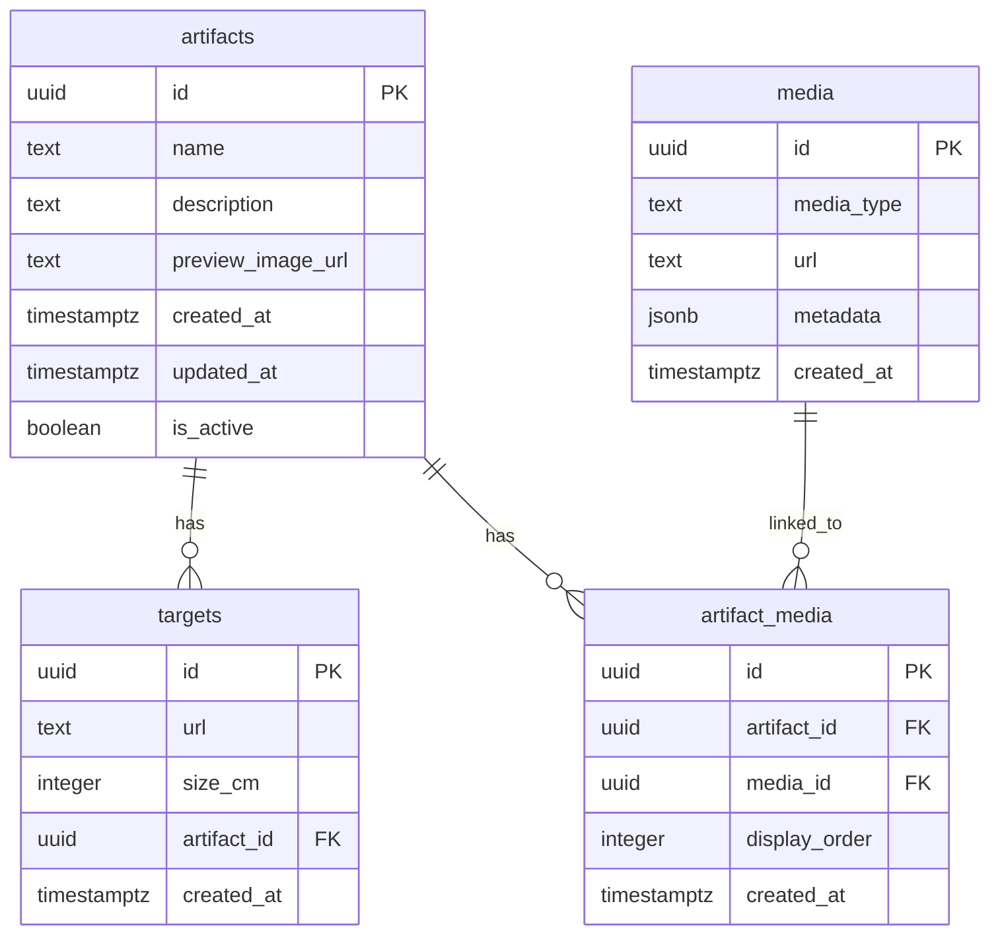

# Схема базы данных

## Описание

База данных использует PostgreSQL через Supabase. Все таблицы имеют Row Level Security (RLS) политики для контроля доступа.

## ER диаграмма



## Описание таблиц

### artifacts

Таблица для хранения артефактов.

| Поле | Тип | Описание |
|------|-----|----------|
| `id` | UUID | Первичный ключ, генерируется автоматически |
| `name` | TEXT | Название артефакта (обязательное) |
| `description` | TEXT | Описание артефакта (Markdown поддерживается) |
| `preview_image_url` | TEXT | URL превью изображения артефакта |
| `created_at` | TIMESTAMPTZ | Дата создания (автоматически) |
| `updated_at` | TIMESTAMPTZ | Дата последнего обновления (автоматически) |
| `is_active` | BOOLEAN | Флаг активности артефакта (по умолчанию true) |

**Индексы:**
- Первичный ключ на `id`
- Индекс на `is_active` для фильтрации активных артефактов

**Триггеры:**
- `update_artifacts_updated_at` - автоматически обновляет `updated_at` при изменении записи

### media

Таблица для хранения медиа-ресурсов (3D модели, видео, YouTube ссылки).

| Поле | Тип | Описание |
|------|-----|----------|
| `id` | UUID | Первичный ключ, генерируется автоматически |
| `media_type` | TEXT | Тип медиа: `'3d_model'`, `'video'`, `'youtube'` |
| `url` | TEXT | URL медиа ресурса (обязательное) |
| `metadata` | JSONB | Дополнительные метаданные |
| `created_at` | TIMESTAMPTZ | Дата создания (автоматически) |

**Ограничения:**
- `media_type` должен быть одним из: `'3d_model'`, `'video'`, `'youtube'`

**Метаданные (metadata JSONB):**

Для 3D моделей:
```json
{
  "center_model": true,
  "size": 1234567,
  "filename": "model.glb"
}
```

Для видео:
```json
{
  "width": 1920,
  "height": 1080,
  "duration": 120.5,
  "filename": "video.mp4",
  "size": 56789012
}
```

### targets

Таблица для хранения таргетов (маркеров) для AR распознавания.

| Поле | Тип | Описание |
|------|-----|----------|
| `id` | UUID | Первичный ключ, генерируется автоматически |
| `url` | TEXT | URL изображения таргета (обязательное) |
| `size_cm` | INTEGER | Размер стороны квадрата таргета в см (по умолчанию 10) |
| `artifact_id` | UUID | Ссылка на артефакт (внешний ключ) |
| `created_at` | TIMESTAMPTZ | Дата создания (автоматически) |

**Связи:**
- `artifact_id` → `artifacts.id` (ON DELETE CASCADE)

**Особенности:**
- Один таргет связан с одним артефактом (1:N связь)
- При удалении артефакта все связанные таргеты удаляются автоматически

### artifact_media

Таблица для связи артефактов с медиа-ресурсами (многие-ко-многим).

| Поле | Тип | Описание |
|------|-----|----------|
| `id` | UUID | Первичный ключ, генерируется автоматически |
| `artifact_id` | UUID | Ссылка на артефакт (внешний ключ) |
| `media_id` | UUID | Ссылка на медиа (внешний ключ) |
| `display_order` | INTEGER | Порядок отображения (0 - наивысший приоритет) |
| `created_at` | TIMESTAMPTZ | Дата создания (автоматически) |

**Связи:**
- `artifact_id` → `artifacts.id` (ON DELETE CASCADE)
- `media_id` → `media.id` (ON DELETE CASCADE)

**Ограничения:**
- Уникальная пара `(artifact_id, media_id)` - один артефакт может быть связан с медиа только один раз

**Особенности:**
- `display_order` определяет порядок приоритета медиа для артефакта
- При удалении артефакта или медиа связь удаляется автоматически

## Row Level Security (RLS) политики

### Политики для чтения (публичный доступ)

**artifacts:**
- `"Artifacts are viewable by everyone"` - все могут просматривать активные артефакты (`is_active = true`)
- `"Authenticated users can view all artifacts"` - авторизованные пользователи могут просматривать все артефакты

**media:**
- `"Media are viewable by everyone"` - все могут просматривать медиа

**targets:**
- `"Targets are viewable by everyone"` - все могут просматривать таргеты

**artifact_media:**
- `"Artifact media are viewable by everyone"` - все могут просматривать связи артефактов с медиа

### Политики для записи (только для авторизованных пользователей)

Все операции INSERT, UPDATE, DELETE доступны только для авторизованных пользователей (`auth.role() = 'authenticated'`):

- `"Authenticated users can insert/update/delete artifacts"`
- `"Authenticated users can insert/update/delete media"`
- `"Authenticated users can insert/update/delete targets"`
- `"Authenticated users can insert/update/delete artifact media"`

## Типичные запросы

### Получить артефакт с медиа и таргетами

```sql
SELECT 
  a.*,
  json_agg(DISTINCT jsonb_build_object(
    'id', t.id,
    'url', t.url,
    'size_cm', t.size_cm
  )) FILTER (WHERE t.id IS NOT NULL) as targets,
  json_agg(DISTINCT jsonb_build_object(
    'id', m.id,
    'media_type', m.media_type,
    'url', m.url,
    'metadata', m.metadata,
    'display_order', am.display_order
  )) FILTER (WHERE m.id IS NOT NULL) as media
FROM artifacts a
LEFT JOIN targets t ON t.artifact_id = a.id
LEFT JOIN artifact_media am ON am.artifact_id = a.id
LEFT JOIN media m ON m.id = am.media_id
WHERE a.id = $1 AND a.is_active = true
GROUP BY a.id;
```

### Получить таргет с артефактом и медиа

```sql
SELECT 
  t.*,
  jsonb_build_object(
    'id', a.id,
    'name', a.name,
    'description', a.description,
    'preview_image_url', a.preview_image_url,
    'media', (
      SELECT json_agg(jsonb_build_object(
        'id', m.id,
        'media_type', m.media_type,
        'url', m.url,
        'metadata', m.metadata
      ) ORDER BY am.display_order)
      FROM artifact_media am
      JOIN media m ON m.id = am.media_id
      WHERE am.artifact_id = a.id
    )
  ) as artifacts
FROM targets t
JOIN artifacts a ON a.id = t.artifact_id
WHERE t.id = $1;
```

## Миграции

Миграции находятся в папке `supabase/migrations/`:

1. `000_base_schema.sql` - базовая схема таблиц
2. `001_update_targets_schema.sql` - обновление схемы таргетов (1:N связь)
3. `002_add_display_order_to_artifact_media.sql` - добавление поля `display_order`
4. `final_schema.sql` - финальная схема со всеми политиками RLS

