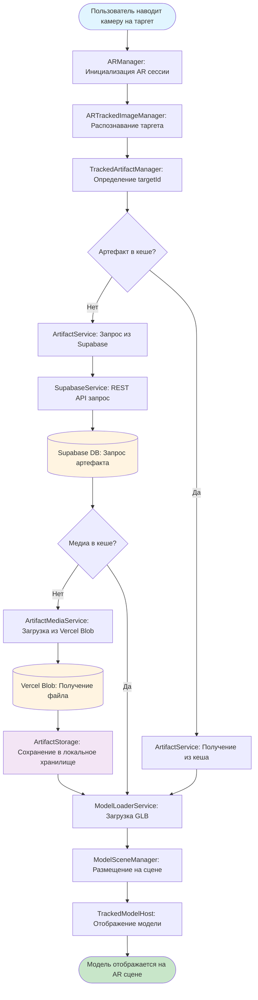
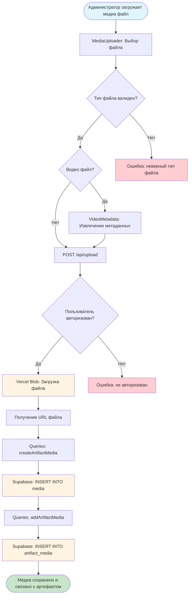
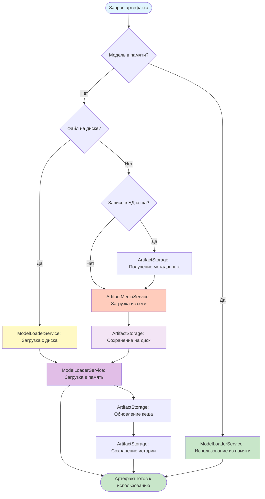
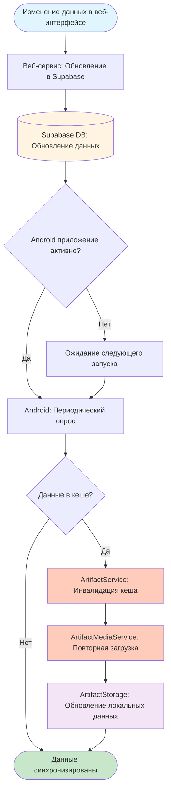
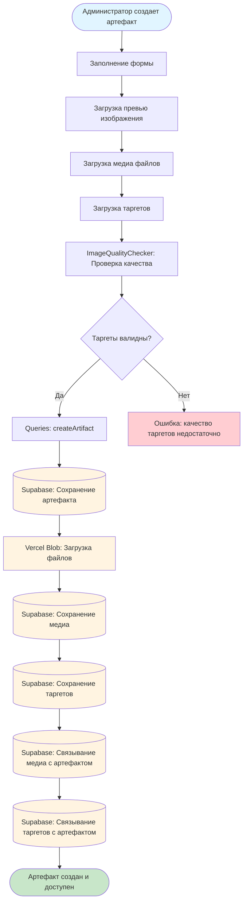
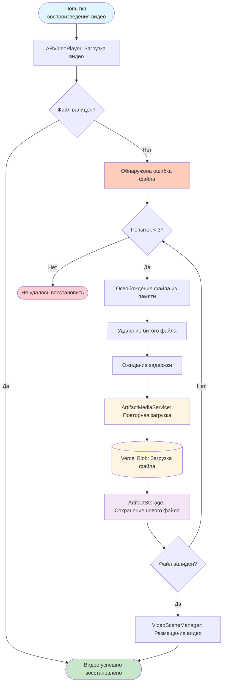
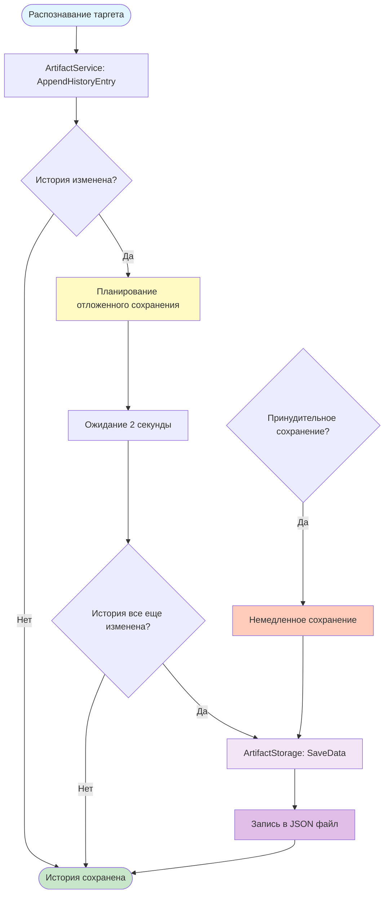

# Процессы и потоки данных

## Описание

Документ описывает потоки данных в системе AR-tifact, включая процессы распознавания таргетов, загрузки медиа, кеширования и синхронизации.

## 1. Поток данных при распознавании таргета

## 2. Поток данных при загрузке медиа

## 3. Кеширование на Android устройстве

## 4. Синхронизация данных

## 5. Процесс создания артефакта

## 6. Автовосстановление битого видео

## 7. Управление историей сканирования

## Особенности потоков данных

### Оптимизация производительности

1. **Кеширование на трех уровнях:**
   - Память (GameObject в ModelLoaderService)
   - Диск (локальные файлы в ArtifactStorage)
   - База данных (метаданные в JSON кеше)

2. **Отложенное сохранение:**
   - История сканирования сохраняется с задержкой 2 секунды
   - Батчинг изменений для уменьшения операций записи

3. **Предотвращение дублирования:**
   - Отслеживание активных запросов
   - Кеширование результатов запросов

### Обработка ошибок

1. **Автовосстановление:**
   - Автоматическое восстановление битых видео файлов
   - До 3 попыток восстановления
   - Экспоненциальная задержка между попытками

2. **Graceful degradation:**
   - Использование кеша при отсутствии сети
   - Показ понятных сообщений об ошибках
   - Сохранение состояния для последующего восстановления

### Синхронизация

1. **Односторонняя синхронизация:**
   - Изменения в веб-интерфейсе сразу доступны в Android
   - Android приложение периодически проверяет обновления
   - Инвалидация кеша при обнаружении изменений

2. **Конфликты:**
   - Последнее изменение имеет приоритет
   - Метаданные обновляются автоматически
   - Медиа файлы перезагружаются при необходимости

